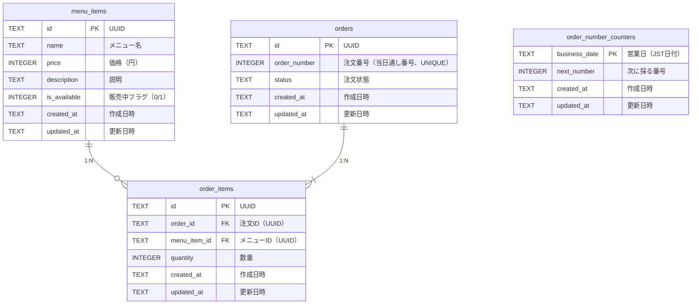

# データベース設計

## 概要

Cloudflare D1（SQLite互換）を使用した文化祭コーヒー注文管理システムのデータベース設計。

## 識別子方針（主キーは UUID）

主キーは **UUID（アプリ側で生成し、`TEXT` で保持）** とする。`INTEGER AUTOINCREMENT` は採用しない。

### なぜ AUTO INCREMENT を避けるか

代表的なデメリットとして、**推測容易性**（連番により注文数や他エンティティの件数が推測されうる）、**マルチリージョン・複数ライターでの衝突**、**シャーディングやレプリカを意識した設計との相性**などが挙げられる。詳しくは次を参照。

- [データベースの主キーに連番を使うのはやめよう #DB - Praha Inc.](https://zenn.dev/praha/articles/3c84e3818891c3)

### UUID を選ぶことのトレードオフ

UUID にも長さ・インデックス局所性・可読性などの pros/cons がある。本プロジェクトでは **Workers 上で `crypto.randomUUID()` がそのまま使える**こと、**クライアント生成 ID（idempotency など）に拡張しやすい**こと、上記の推測耐性を優先して UUID とする。

- [データベースのIDにUUIDを使うべきか #データベース - RAPICRO](https://rapicro.com/database_id/)

**実装メモ:** カラム型は `TEXT`、形式は UUID v4（または必要に応じて v7）を想定する。

## 監査カラム（全テーブル共通）

**すべてのテーブル**に次の2カラムを持たせる。

| カラム         | 型   | 制約 | 説明 |
| -------------- | ---- | ---- | ---- |
| `created_at`   | TEXT | NOT NULL DEFAULT (datetime('now', '+9 hours')) | 行の作成日時（JST 相当の保存値） |
| `updated_at`   | TEXT | NOT NULL DEFAULT (datetime('now', '+9 hours')) | 行の最終更新日時（JST 相当） |

- **INSERT** 時: 省略時はデフォルトで両方とも「作成時刻」が入る。
- **UPDATE** 時: **`updated_at` を必ず更新する**（アプリで `datetime('now', '+9 hours')` をセットする、または SQLite の `AFTER UPDATE` トリガーで自動更新する）。

一覧・デバッグ・同期の追跡をしやすくするための標準とする。

## ER図



## テーブル定義

### `menu_items` — メニューマスタ

販売するコーヒーメニューを管理する。

| カラム           | 型      | 制約                      | 説明                                 |
| ---------------- | ------- | ------------------------- | ------------------------------------ |
| `id`             | TEXT    | PRIMARY KEY               | メニューID（UUID）                   |
| `name`           | TEXT    | NOT NULL                  | メニュー名（例: ブレンドコーヒー）   |
| `price`          | INTEGER | NOT NULL                  | 価格（円）                           |
| `description`    | TEXT    |                           | 説明文                               |
| `is_available`   | INTEGER | NOT NULL DEFAULT 1        | 販売中フラグ（1=販売中, 0=売り切れ） |
| `created_at`     | TEXT    | NOT NULL DEFAULT (datetime('now', '+9 hours')) | 作成日時（共通ルール参照）           |
| `updated_at`     | TEXT    | NOT NULL DEFAULT (datetime('now', '+9 hours')) | 最終更新日時（UPDATE 時に更新）      |

### `orders` — 注文

客の注文を管理する。`order_number` は当日の通し番号で、客に見せる番号として使用する（UUID の `id` とは別）。

| カラム         | 型      | 制約                               | 説明                               |
| -------------- | ------- | ---------------------------------- | ---------------------------------- |
| `id`           | TEXT    | PRIMARY KEY                        | 注文ID（UUID・内部識別子）         |
| `order_number` | INTEGER | NOT NULL UNIQUE                    | 注文番号（当日通し番号、客に表示） |
| `status`       | TEXT    | NOT NULL DEFAULT 'pending' CHECK(status IN ('pending','brewing','ready','completed','cancelled')) | 注文状態（理由は下記「列挙的な値の表現」参照） |
| `created_at`   | TEXT    | NOT NULL DEFAULT (datetime('now', '+9 hours')) | 作成日時（共通ルール参照）         |
| `updated_at`   | TEXT    | NOT NULL DEFAULT (datetime('now', '+9 hours')) | 最終更新日時（状態変更のたびに更新） |

**注文状態（`status`）の遷移:**

```text
pending → brewing → ready → completed
                           → cancelled
```

| status      | 説明                             |
| ----------- | -------------------------------- |
| `pending`   | 注文受付済み・未着手             |
| `brewing`   | ドリップ中                       |
| `ready`     | 提供準備完了（客の受け取り待ち） |
| `completed` | 受け渡し完了                     |
| `cancelled` | キャンセル                       |

#### 注文番号（`order_number`）の採番について

`order_number` を「当日の通し番号」にすると、**新規 INSERT 時にその日の最大値＋1 を安全に取る**必要があり、実装・同時実行の扱いがやや面倒になる（単純な `MAX(order_number)` は競合で重複しうる）。

取りうる方針の例:

| 方針 | 概要 | コメント |
| ---- | ---- | -------- |
| 日次カウンタ行 | `business_date` をキーにした1行を更新し、カウンタを原子的にインクリメントしてから注文を INSERT | D1/SQLite でもトランザクション内で扱いやすい |
| 専用テーブル + `UPDATE ... RETURNING` 相当 | 採番用テーブルを1行ロック気味に更新 | 同上 |
| アプリ単一ライター（DO 等） | 採番だけ直列化 | 規模が小さければ過剰になりうる |

本ドキュメントでは **日次（または営業日単位）のカウンタを別テーブルまたは既知の1行で管理し、注文 INSERT と同一トランザクションで整合させる** 方向を推奨とする（具体 SQL は実装フェーズで確定）。参考として外部の整理も参照。

- [Gemini 共有リンク（採番・カウンタの整理の参考）](https://gemini.google.com/share/0f0f63f5f337)

### `order_items` — 注文明細

注文に含まれる各メニューの明細。価格は `menu_items.price` をJOINで参照する。

| カラム         | 型      | 制約                                | 説明               |
| -------------- | ------- | ----------------------------------- | ------------------ |
| `id`           | TEXT    | PRIMARY KEY                         | 明細ID（UUID）     |
| `order_id`     | TEXT    | NOT NULL, REFERENCES orders(id)     | 注文ID             |
| `menu_item_id` | TEXT    | NOT NULL, REFERENCES menu_items(id) | メニューID         |
| `quantity`     | INTEGER | NOT NULL DEFAULT 1                  | 数量               |
| `created_at`   | TEXT    | NOT NULL DEFAULT (datetime('now', '+9 hours')) | 作成日時（共通ルール参照） |
| `updated_at`   | TEXT    | NOT NULL DEFAULT (datetime('now', '+9 hours')) | 最終更新日時（UPDATE 時に更新） |

### `order_number_counters` — 当日注文番号カウンタ

`order_number` の採番用。`business_date` は `orders.created_at` と同じルールの **JST 営業日**（例: `YYYY-MM-DD`）で揃える。

| カラム           | 型      | 制約                      | 説明                                       |
| ---------------- | ------- | ------------------------- | ------------------------------------------ |
| `business_date`  | TEXT    | PRIMARY KEY               | 営業日（JST の日付文字列）                 |
| `next_number`    | INTEGER | NOT NULL DEFAULT 1        | 次に割り当てる通し番号（採番後にインクリメント） |
| `created_at`     | TEXT    | NOT NULL DEFAULT (datetime('now', '+9 hours')) | 作成日時（共通ルール参照）           |
| `updated_at`     | TEXT    | NOT NULL DEFAULT (datetime('now', '+9 hours')) | 最終更新日時（カウンタ更新のたびに更新） |

## 列挙的な値の表現（`status` など）

「状態」のような列挙的な値の持ち方には、大きく次がある。

| 方式 | メリット | デメリット |
| ---- | -------- | ---------- |
| 外部テーブル（マスタ＋FK） | DB 上で参照整合性を厳密に取れる、表示ラベルや並び順を DB で持てる | テーブル・JOIN が増える |
| `CHECK` 付き `TEXT`（本設計） | シンプル、マイグレーションが SQLite/D1 で扱いやすい | 値の追加はスキーマ変更（`CHECK` 更新）が必要 |
| （RDB の）`ENUM` 型 | 宣言的 | SQLite にはネイティブ ENUM がなく、D1 でも SQLite 互換の範囲で考える |

本プロジェクトでは **状態の種類が少なく、ほぼ固定**であり、**スタッフ画面はアプリ側の定数と i18n でラベル管理**で足りる想定のため、`TEXT` ＋ `CHECK` とする。外部テーブル化するほどの可変性・多言語ラベル保管の要件はない、という判断。

- [PostgreSQLにおける列挙型の扱い方針 #PostgreSQL - convers39](https://zenn.dev/convers39/articles/0e58e17d0da43f)  
  （PostgreSQL 向けだが、「マスタ化するか CHECK か」の意思決定の整理として参照）

## インデックス

SQLite では **PRIMARY KEY** および **UNIQUE** 制約に対応するインデックスが自動的に付与される。  
**FOREIGN KEY 参照元カラムには自動でインデックスが付かない**ため、JOIN・子取得が多い列は明示的にインデックスを張る。

本システムで想定する主なクエリパターン:

| パターン | 例 | インデックス方針 |
| -------- | -- | ---------------- |
| 客が注文番号で自分の注文を引く | `WHERE order_number = ?` | `order_number` は `UNIQUE` によりインデックス済み |
| ドリップ係・会計係が「未完了の注文」を一覧 | `WHERE status IN (...)` ＋ `ORDER BY created_at` | 複合 `(status, created_at)` を検討（フィルタ後の並び替えコスト低減） |
| 1注文の明細を全部取る | `WHERE order_id = ?` | `order_items(order_id)` に明示インデックス |
| 客向けメニュー（販売中のみ） | `WHERE is_available = 1` | 件数が少なければフルスキャンでも可。増えたら `menu_items(is_available)` または部分インデックス相当の検討 |

**推奨（初期案）:**

```sql
-- FK 子側（SQLite は FK に自動インデックスなし）
CREATE INDEX idx_order_items_order_id ON order_items(order_id);

-- スタッフ画面: 状態別の新しい順
CREATE INDEX idx_orders_status_created_at ON orders(status, created_at);
```

`menu_items(is_available)` はデータ量を見てから追加する。**UUID 主キー＋上記 FK 用インデックスのみでも最小構成は成立する**が、スタッフ画面の `status` 絞り込みが主経路のため `(status, created_at)` は早めに入れてよい。

## 設計判断

### 金額をINTEGERで管理

文化祭の価格は全て円単位の整数。浮動小数点の誤差を避けるためINTEGERを使用する。

### `order_number`（通し番号）と `id`（UUID）の分離

`id` は内部・API・外部連携で使う不変の識別子、`order_number` は客に見せる当日の通し番号。日をまたいで運用する場合でも、内部 ID の連番推測に依存しない。

### 金額は `menu_items.price` から都度算出

`order_items` に単価カラムは持たない。価格変更がないため `menu_items.price` をJOINで参照し、`SUM(price * quantity)` で合計を算出する。

### 日時はJST（UTC+9）で保存

`datetime('now', '+9 hours')` でJST相当の値を保存する。文化祭は日中の1日イベントのため、タイムゾーン変換の複雑さよりも、保存値がそのまま日本時間として読める利便性を優先した。`created_at` / `updated_at` のデフォルトも同じ式を用いる（上記「監査カラム」参照）。
