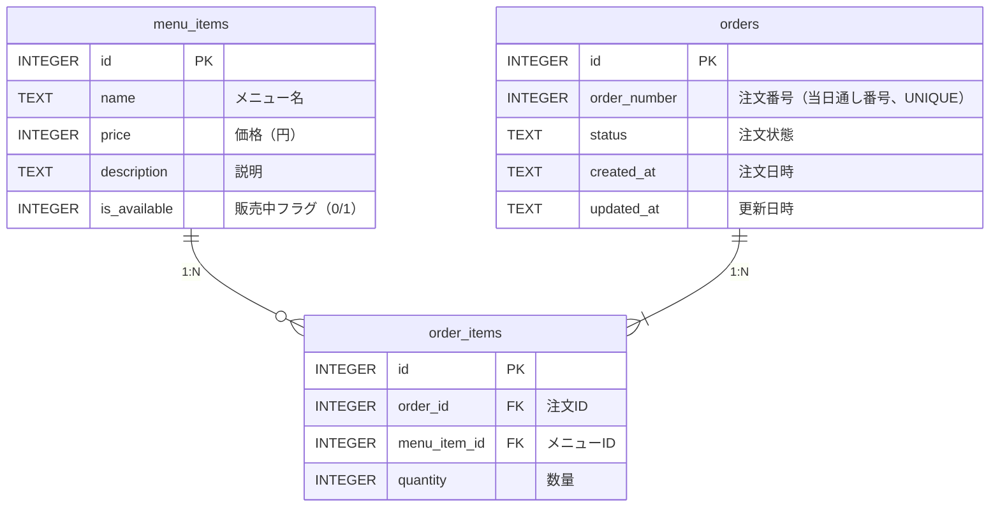

# データベース設計

## 概要

Cloudflare D1（SQLite互換）を使用した文化祭コーヒー注文管理システムのデータベース設計。

## ER図



## テーブル定義

### `menu_items` — メニューマスタ

販売するコーヒーメニューを管理する。

| カラム          | 型      | 制約                      | 説明                                 |
| --------------- | ------- | ------------------------- | ------------------------------------ |
| `id`            | INTEGER | PRIMARY KEY AUTOINCREMENT | メニューID                           |
| `name`          | TEXT    | NOT NULL                  | メニュー名（例: ブレンドコーヒー）   |
| `price`         | INTEGER | NOT NULL                  | 価格（円）                           |
| `description`   | TEXT    |                           | 説明文                               |
| `is_available`  | INTEGER | NOT NULL DEFAULT 1        | 販売中フラグ（1=販売中, 0=売り切れ） |

### `orders` — 注文

客の注文を管理する。`order_number` は当日の通し番号で、客に見せる番号として使用する。

| カラム         | 型      | 制約                               | 説明                               |
| -------------- | ------- | ---------------------------------- | ---------------------------------- |
| `id`           | INTEGER | PRIMARY KEY AUTOINCREMENT          | 注文ID（内部用）                   |
| `order_number` | INTEGER | NOT NULL UNIQUE                    | 注文番号（当日通し番号、客に表示） |
| `status`       | TEXT    | NOT NULL DEFAULT 'pending' CHECK(status IN ('pending','brewing','ready','completed','cancelled')) | 注文状態                           |
| `created_at`   | TEXT    | NOT NULL DEFAULT (datetime('now', '+9 hours')) | 注文日時                           |
| `updated_at`   | TEXT    | NOT NULL DEFAULT (datetime('now', '+9 hours')) | 更新日時                           |

**注文状態（`status`）の遷移:**

```text
pending → brewing → ready → completed
                           → cancelled
```

| status      | 説明                             |
| ----------- | -------------------------------- |
| `pending`   | 注文受付済み・未着手             |
| `brewing`   | ドリップ中                       |
| `ready`     | 提供準備完了（客の受け取り待ち） |
| `completed` | 受け渡し完了                     |
| `cancelled` | キャンセル                       |

### `order_items` — 注文明細

注文に含まれる各メニューの明細。価格は `menu_items.price` をJOINで参照する。

| カラム         | 型      | 制約                                | 説明               |
| -------------- | ------- | ----------------------------------- | ------------------ |
| `id`           | INTEGER | PRIMARY KEY AUTOINCREMENT           | 明細ID             |
| `order_id`     | INTEGER | NOT NULL, REFERENCES orders(id)     | 注文ID             |
| `menu_item_id` | INTEGER | NOT NULL, REFERENCES menu_items(id) | メニューID         |
| `quantity`     | INTEGER | NOT NULL DEFAULT 1                  | 数量               |

## 設計判断

### 金額をINTEGERで管理

文化祭の価格は全て円単位の整数。浮動小数点の誤差を避けるためINTEGERを使用する。

### `order_number`（通し番号）と`id`の分離

`id` は内部の主キー、`order_number` は客に見せる当日の通し番号。日をまたいで運用する場合でもIDの連続性に依存しない。

### 金額は `menu_items.price` から都度算出

`order_items` に単価カラムは持たない。価格変更がないため `menu_items.price` をJOINで参照し、`SUM(price * quantity)` で合計を算出する。

### 日時はJST（UTC+9）で保存

`datetime('now', '+9 hours')` でJST相当の値を保存する。文化祭は日中の1日イベントのため、タイムゾーン変換の複雑さよりも、保存値がそのまま日本時間として読める利便性を優先した。
